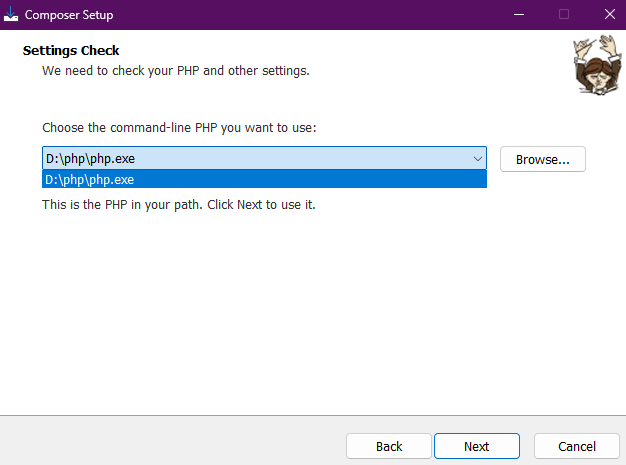
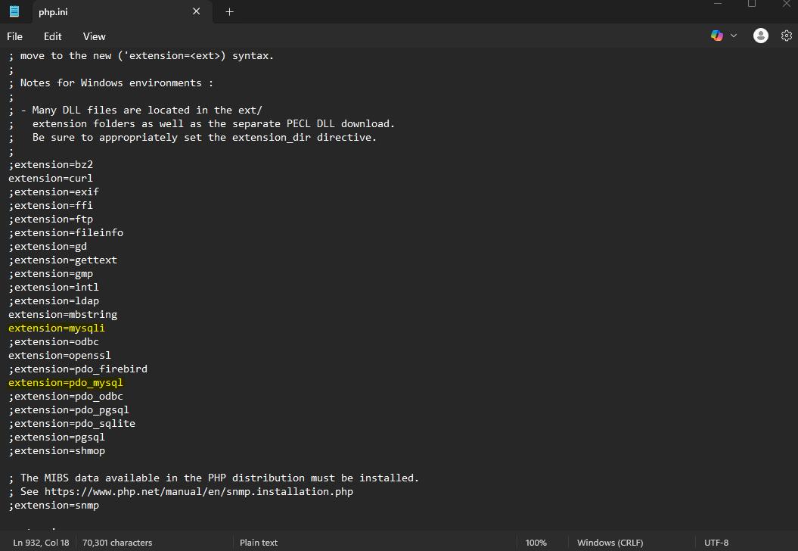

# <mark>ITELECT1---GROUP-4</mark>
---
## FINAL EXAMINATION
---
**Instructions:**
---
1. Run XAMPP
2. Start <mark>Apache</mark> and <mark>mySQL</mark> 
3. **visit:** [phpmyadmin](localhost/phpmyadmin)
4. Import the <mark>**medical_appointment_db.sql**</mark> on the <mark>**SQL**</mark> tab 
5. Check if the <mark>**medical_appointment_db**</mark> exists on the left panel
6. Go to **VSCode** and open the repository you just cloned
7. 📁*Example:*
>C:\Users\<user>\medical_appointment_system\ITELECT1---GROUP-4\medical_appointment_system
8. Open the terminal of VSCode with <mark>**CTRL + ~**</mark>
9. **Enter command:**
```php artisan serve```
10. click the **127.0.0.1:port_number** link and see if the API runs without any errors
---
## **If you run into an error, update your PHP version to 8.5.0^ or the latest version**
### ❌ ***Make sure to reconfigure Composer PHP directory to the latest one*** ❌
---

---
### ❌ ***If running php artisan serve does not work uncomment the extensions*** ❌
**Open your php 8.5.0 and the php.ini file and edit the following:**
> ;extension=mysqli => extension=mysqli
> ;extension=pdo_mysql => extension=mysqli

## <mark>Members:</mark>
- Bernabe, Lance Carlo
- David, John Kerby
- Jabonete, King Hedson Reyll
- Lacsina, Sean Patrick
- Quito, Patrice
- Santos, Kian Kerby
